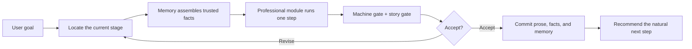
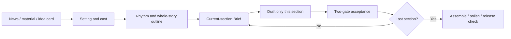
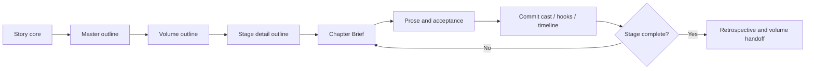

# novel-assistant

One entry point for planning, drafting, reviewing, deconstructing, and polishing Chinese web fiction.

`novel-assistant` evolved from the excellent upstream project [worldwonderer/oh-story-claudecode](https://github.com/worldwonderer/oh-story-claudecode). It preserves upstream's professional fiction capabilities while addressing production failures such as interrupted tasks, drifting memory, wasted tokens, structural expansion, and model degradation.

> The current release prioritizes a stable end-to-end short-form workflow. Long-form writing, review, deconstruction, trend research, import, and de-AI polishing remain available.

## Quick Start

### Install

```bash
npx skills add https://github.com/duiniwukenaihe/novel-assistant-skill.git --path skills/novel-assistant -y -g
```

Remove `-g` for a project-local install.

### Use

Enter the story directory and invoke this in Claude Code, Codex, or ZCode:

```text
/novel-assistant
```

Then describe the goal naturally:

```text
Start a Fanqie fantasy novel.
Start a short-form story.
Resume my unfinished task.
Review the current volume's plot, cast, and hooks.
Expand volume one from 12 to 20 chapters.
Deconstruct this book and extract reusable craft lessons.
Remove AI-like prose without changing the story.
```

A new directory shows creation entries. An existing story surfaces unfinished work first. Native arrow-key menus are preferred, numbered choices are the fallback, and free-form correction is always available.

## Why It Exists

| Production problem | Design |
|---|---|
| too many subskills | users remember only `/novel-assistant`; routing stays internal |
| progress disappears across sessions | Workflow persists tasks, stages, checkpoints, and next actions |
| every step rereads the whole book | Memory retrieves only relevant facts, cast, and hooks |
| drafting jumps directly from idea to prose | setting, outline, and Brief precede section/chapter drafting |
| upstream edits leave stale downstream work | impact analysis invalidates affected Briefs, prose, and checks |
| expansion breaks titles and continuity | impact audit precedes migration of prose, hooks, and timeline |
| fewer AI phrases but still weak fiction | machine gates check pollution; story gates check logic and emotion |
| repetition and tool failures burn tokens | health gates, retry budgets, checkpoints, and managed early stop |

## Workflow

Professional modules write, review, or analyze. Workflow turns those steps into a task that can continue, recover, and accept correction.



Local wording changes stay local. Changes to motivation, causality, reversals, or rhythm update the appropriate setting or outline first, then regenerate only affected Briefs.

### Short-form



Expansion, contraction, insertion, deletion, or reordering updates the whole-story plan before deciding which Briefs and prose remain valid.

### Long-form



Volume-local numbering supports expansion. Existing titles and usable prose are preserved when possible; publication export generates continuous book-wide numbering.

## Memory And Quality

Memory is a trusted story-fact layer, not a dump of old chat:

- accepts adopted prose, confirmed settings, and trusted results only;
- retrieves by project, task, and target chapter instead of injecting the whole book;
- separates canonical facts, suggestions, and polluted output;
- uses relative asset identities so moved projects resume across tools;
- exposes a replaceable storage boundary for an external workbench.

Each prose unit closes its own loop:

1. **Planning admission:** goal, resistance, causality, choice, and hook are executable.
2. **Machine gate:** repetition, engineering leakage, punctuation abuse, viewpoint, and naming drift.
3. **Story gate:** story value, logic, humanity, emotional movement, and outline fulfillment.
4. **Accepted commit:** only adopted work updates canonical prose and Memory.

Normal sections use lightweight checks. Climaxes, reversals, character turns, and canon changes receive stronger review only when needed.

## Capabilities

Long- and short-form writing, review and repair, deconstruction, trend research, de-AI polishing, reverse import, cover tasks, structural expansion, and publication assembly all begin from the same entry point.

## Public And Local Extensions

The public package contains public modules and the shared Workflow / Memory kernel. Public short-form work is owned by `story-short-write`. Local installations may load private enhancements; both modes follow the same task, memory, and quality contracts.

Public release automation removes private extensions, personal materials, manuscripts, demos, logs, LAN addresses, and machine paths, then runs privacy and install checks.

## Updates And Docs

Inside the skill, enter:

```text
/novel-assistant update skill
```

Global skill updates, project-environment sync, and directory migration remain separate actions. None silently rewrites prose, outlines, or settings.

- [Workflow protocol](docs/workflow.md)
- [Workflow / Memory boundaries](docs/workflow-memory-subskill-contract.md)
- [Installation and updates](docs/installation-and-update.md)
- [Production readiness](docs/production-readiness.md)
- [Changelog](CHANGELOG.md)

## Acknowledgments

- [worldwonderer/oh-story-claudecode](https://github.com/worldwonderer/oh-story-claudecode), the important upstream and capability foundation.
- Other referenced projects are listed in [the source registry](docs/reference-projects.json).
- Codex / GPT-5.5, which helped turn long-term writing feedback into architecture, implementation, tests, and documentation.

Remember one thing: enter the story directory, invoke `/novel-assistant`, and say what you want to do.
