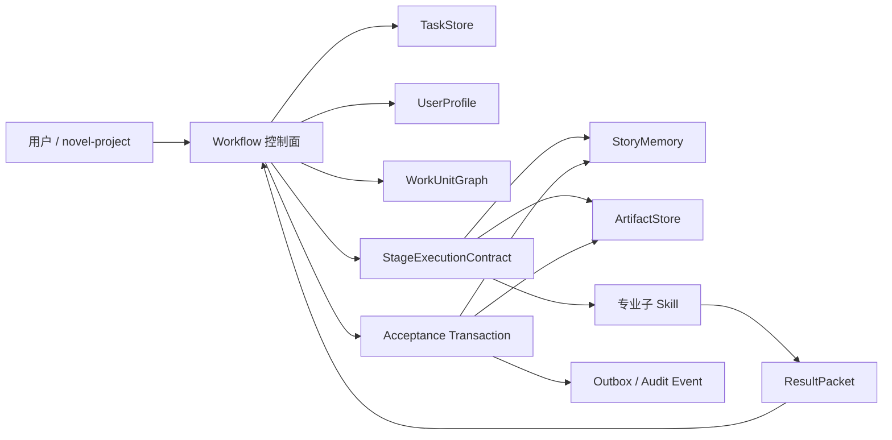

# Workflow、Memory 与子 Skill 架构 V2

> 状态：设计基线，等待实施。本文描述目标架构，不代表当前运行时已经全部实现。

## 1. 结论

现有方向是正确的：`story-workflow` 管生命周期，`story-memory` 管可验证记忆，专业子 skill 管领域工作，正式制品通过事务接受。但当前实现仍有协议漂移，尚不能把“文档边界”视为“运行时强约束”。

必须优先解决六项问题：

1. 阶段模板没有显式声明记忆读取、更新和投影策略；运行时仍按 workflow 名称推断。
2. 托管 runner 与交互式 Claude/Codex/ZCode 的记忆合同不同，长篇及非短篇交互阶段可缺少读取回执。
3. 通用记忆投影失败后，状态机仍可能推进下一阶段。
4. `lifecycle_transition_request` 已进入结果合同，但状态机没有把它作为受控迁移请求消费。
5. 任务总览和子任务导航只对短篇回炉队列完整生效，尚未成为所有多阶段任务的通用能力。
6. repository 已存在，但上下文构建与部分控制脚本仍直接访问文件系统，PostgreSQL 接管无法做到真正等价。

## 2. 领域模型



### 2.1 四个权威域

| 权威域 | 唯一职责 | 禁止承担 |
| --- | --- | --- |
| TaskStore | 任务、阶段、子任务、租约、断点、确认、焦点 | 小说事实和正文内容 |
| StoryMemory | 已接受事实、人物状态、承诺、钩子、规则、证据和版本 | 下一步决策和任务菜单 |
| ArtifactStore | 大纲、Brief、正文、报告、候选稿及版本 | 生命周期推进 |
| UserProfile | 交互偏好、平台偏好、模型画像、经确认的作者规则 | 单篇临时剧情事实 |

`current-task.json` 只允许保存界面焦点。任何写入、提交、记忆投影和恢复都必须通过 `workflow_id -> task_dir/task.json` 获取不可变任务快照。

### 2.2 三个执行角色

| 角色 | 允许 | 禁止 |
| --- | --- | --- |
| Workflow | 选择 owner、创建合同、授权读写集、展示菜单、接受结果、推进状态 | 代替专业模块写故事或作内容判断 |
| Memory | 根据查询合同检索、压缩、版本化、隔离冲突、投影已接受事实 | 主动决定阶段、修改任务、写正文 |
| 专业子 skill | 使用唯一阶段包完成写作、审阅、拆文、扫榜、去 AI 或封面任务 | 扫描任务、直接调用其他专业模块、直接写全局记忆、直接推进状态 |

## 3. 统一阶段合同

每个模板阶段必须声明完整 `StageExecutionContract`，不再由 workflow 名称或脚本正则猜测。

```json
{
  "stage_id": "prose_acceptance",
  "owner_module": "story-review",
  "scope_contract": {
    "unit_type": "chapter",
    "unit_id_source": "task_snapshot",
    "read_set": ["stage-context/**", "candidate-prose/**"],
    "write_set": ["task-artifacts/review/**"]
  },
  "memory_contract": {
    "read_mode": "required",
    "profile": "prose_acceptance",
    "needs": ["accepted_facts", "active_cast", "active_promises", "voice_rules"],
    "budget_policy": "adaptive_current_unit",
    "receipt_required": true,
    "update_mode": "suggest",
    "projection_mode": "after_accept"
  },
  "transition_contract": {
    "allowed": ["prose", "chapter_commit"],
    "default_on_pass": "chapter_commit",
    "default_on_fail": "prose"
  },
  "interaction_contract": {
    "visibility": "workflow_only",
    "confirmation": "risk_based"
  }
}
```

### 3.1 记忆策略必须拆成三项

- `read_mode`：本阶段是否必须读取记忆。
- `update_mode`：子 skill 是否可以提出记忆建议及允许的域。
- `projection_mode`：结果接受后如何投影，失败是否阻断推进。

禁止再用一个 `accepts_memory_updates` 同时表达读取和写入语义。

### 3.2 Memory Query 由阶段声明

专业模块负责定义自己需要的事实类型，workflow 只负责校验和提交查询，memory 负责执行。禁止通过 `workflow_type` 粗粒度推断需求。

示例：

- 长篇正文：当前人物状态、未兑现承诺、连续性义务、当前卷/阶段约束、作者声口。
- 短篇当前节：已接受前序节、当前节规划合同、人物关系、到期钩子、禁写漂移点。
- 审阅：canon、规划依赖、人物与钩子状态、审阅规则；旧报告只能作为带缓存键的制品。
- 去 AI：事实锁、人物锁、情节功能锁、作者声口；不得为了过检测改变故事。
- 扫榜：平台偏好和时间范围；禁止读取当前作品人物与剧情。
- 封面：作品身份、题材、视觉偏好；默认不产生故事事实更新。

## 4. 任务与子任务

所有多阶段 workflow 统一使用 `WorkUnitGraph`，短篇回炉队列不再是特例。

```text
任务 Task
  -> 任务总览 TaskPlan
      -> 工作单元 WorkUnit（卷 / 阶段 / 章 / 节 / 审阅批 / 修复项）
          -> 当前执行点 StageAttempt
              -> 候选产物 -> 验收 -> 接受 / 回炉 / 暂停
```

### 4.1 用户可见层级

进入未完成任务后先展示任务总览：

1. 继续当前子任务（推荐）
2. 查看全部子任务与完成度
3. 回炉已完成子任务
4. 输入修改意见或调整任务计划

打开当前子任务后再展示该子任务的动作。子 skill 不得把内部 stage 名、finalizer 命令或 shell Error 直接暴露给用户。

### 4.2 Chat 反馈

任何阶段都允许 Chat 介入，但先分类影响：

- 只影响当前候选稿：回炉当前 WorkUnit。
- 影响 Brief/细纲：回退到对应规划 WorkUnit，并使下游制品失效。
- 影响卷纲/总纲/设定：生成影响图和修订队列，用户确认后按依赖顺序重算。
- 只是偏好：写 UserProfile 或当前任务规则，不修改 canon。
- 新目标：创建并切换新任务；旧任务保留断点，不得被覆盖或强制停止。

原始聊天只保留审计。进入任务决策记忆的是助手归纳后的方案快照和用户确认 ID；进入 StoryMemory 的只能是正式制品接受后的事实。

### 4.3 任务形态必须显式识别

调度器不能把所有任务都当成一条阶段数组。创建任务时必须从模板得到 `execution_shape`，不允许模型在执行中临时发明流程。

| 任务形态 | 示例 | 调度方式 |
| --- | --- | --- |
| `single_unit` | 单章只读审阅、生成封面 | 单个 WorkUnit，完成即收束 |
| `linear_pipeline` | 新书准备、导入、单章写作 | 按硬依赖顺序推进 |
| `bounded_loop` | 正文 -> 机器门 -> 局部修复 -> 复检 | 有界循环；同一失败签名不得无限重试 |
| `map_reduce` | 分卷审阅、长篇拆文、分批扫描 | 独立批次可并发，聚合节点等待所需批次 |
| `dependency_dag` | 整篇回炉、结构调整、扩容缩容 | 依据制品依赖图选择最小受影响子图 |
| `long_running_family` | 连载长篇、持续素材学习 | 每个里程碑创建有限任务；任务族保存连续关系，不创建永不结束的单任务 |

每个 workflow 模板必须声明：

```json
{
  "execution_shape": "dependency_dag",
  "unit_factory": "short_section_revision_units",
  "completion_rule": "all_required_units_accepted_no_debt",
  "repeat_policy": "revisioned_attempts",
  "impact_policy": "artifact_dependency_closure",
  "concurrency_policy": "disjoint_read_or_staging_write_only"
}
```

用户意图识别只决定“恢复哪个任务、创建哪类任务、还是提交当前任务反馈”。真正的阶段和依赖来自模板。无法唯一识别目标作品、任务或修改范围时，workflow 才询问一次，不得先执行再猜。

### 4.4 WorkUnitGraph

`WorkUnitGraph` 是所有多阶段任务的统一调度真相，不再同时维护线性 `remaining_stages`、短篇专属队列和审阅批次三套互不等价的状态。

```json
{
  "graph_revision": 7,
  "units": [{
    "unit_id": "section:007:prose",
    "kind": "prose",
    "owner_module": "story-short-write",
    "scope": {"section": 7},
    "status": "ready",
    "depends_on": ["section:007:brief"],
    "consumes": ["brief:007@3", "planning-contract@8", "memory@41"],
    "produces": ["section-prose:007"],
    "accepted_revision": 0,
    "current_attempt": 2,
    "repeat_policy": "revisioned_attempts",
    "impact_boundary": "downstream_dependencies"
  }],
  "edges": []
}
```

边类型必须明确：

- `requires`：前置单元未接受时不可运行。
- `consumes_artifact`：输入制品 revision 变化时需要复检。
- `continuity`：人物、因果、钩子或时间线的连续依赖。
- `quality_of`：质量门绑定候选制品，不产生新的剧情事实。
- `aggregates`：总报告、合稿或卷级验收等待一组子单元。
- `invalidates_on_change`：上游发生指定类型变化时使下游失效。
- `suggests_next`：只用于推荐，不构成硬依赖。

### 4.5 状态模型

任务、工作单元和执行尝试必须分层，避免“阶段完成”和“任务完成”混为一谈。

**Task 状态**：`planned | active | waiting_user | blocked | paused | completed | cancelled | superseded`。

**WorkUnit 状态**：`planned | ready | running | candidate_ready | waiting_user | blocked | accepted | stale | superseded | cancelled`。

**Attempt 状态**：`created | running | failed_infrastructure | failed_quality | candidate | accepted | rejected | abandoned`。

约束：

- Attempt 失败不等于 WorkUnit 失败。
- WorkUnit 接受不等于 Task 完成。
- Task 完成要求所有必需 WorkUnit 已接受、没有 `stale`、没有投影债务、没有未处理确认。
- 已完成任务不能原地重新打开；后续回炉创建 successor task，并引用原任务和已接受制品。

### 4.6 确定性调度算法

每次入口和每次结果接受后都运行同一调度器：

1. 解析项目身份和用户意图：恢复、反馈、新任务或维护。
2. 读取指定 `workflow_id` 的任务快照，不从 UI 焦点推断写目标。
3. 校验图 revision、会话租约、投影债务和待确认动作。
4. 计算 eligible WorkUnit：硬依赖已接受、输入 revision 当前、owner 可用、读写集无冲突。
5. 按优先级选择推荐单元，但不越过用户要求的目标范围。
6. 显示任务总览；用户进入子任务后才创建 StageAttempt。
7. 构建唯一 StageContextEnvelope，取得租约并执行专业子 skill。
8. 校验 Result Packet，接受候选制品，计算 ChangeSet 和影响闭包。
9. 完成记忆投影和 outbox 后更新 WorkUnitGraph。
10. 推荐下一个 eligible WorkUnit；若没有，则检查任务完成条件。

推荐优先级固定为：

```text
用户明确选择
  > 已接受制品的投影/提交债务
  > 当前子任务的必要恢复
  > 关键路径上的 ready 单元
  > 到期连续性义务
  > 可选优化与智能推荐
```

同级单元按稳定的模板顺序和 `unit_id` 排序，禁止每次启动重新随机推荐。

### 4.7 重复执行语义

“再执行一次”必须先判断重复发生在哪一层。

| 情况 | 新建什么 | 旧产物 | 影响范围 |
| --- | --- | --- | --- |
| 工具/API/路径等基础设施失败 | 同一 WorkUnit 的新 Attempt | 保留日志，无候选制品 | 当前 Attempt；不影响下游 |
| 候选稿未接受，用户要求重写 | 同一 WorkUnit 的新 Attempt | 旧候选归档为 rejected/abandoned | 当前 WorkUnit |
| 质量门未过后局部修复 | 修复 Attempt | 原候选保留供 diff | 当前 WorkUnit + 对应质量门 |
| 已接受正文只改措辞，不改事实 | 新 Artifact revision | 旧 revision 标记 superseded | 当前正文、质量门、合稿索引 |
| 已接受正文改变人物事实/钩子/因果 | 新 Artifact revision + ChangeSet | 旧 revision 可追溯 | 沿 continuity/artifact 边复检下游 |
| Brief/细纲/卷纲等上游契约改变 | 新上游 revision | 已接受下游不删除 | 下游标记 `needs_recheck` 或 `stale` |
| 完整任务重新执行 | successor task | 原任务保持 completed/paused | 新任务独立，不清空旧任务 |
| 同一命令由多会话重复提交 | 不创建新 Attempt | 返回既有幂等结果 | 无影响 |

默认原则：**重复执行只影响当前 WorkUnit；只有新旧已接受版本的语义 ChangeSet 命中显式依赖边时，才向下游传播。**

不得因为某节重写就自动重跑整篇，也不得因为旧正文已经接受就假装它永远不受上游变化影响。

### 4.8 ChangeSet 与影响传播

影响范围不能只靠用户自然语言中的“正文、细纲、卷纲”等关键词判断。接受新 revision 时必须比较结构化差异：

```json
{
  "changed_artifact": "section-prose:007@4",
  "change_types": ["character_decision", "promise_state"],
  "entities": ["character:lin-zhao"],
  "promises_opened": ["promise:public-production-stream"],
  "promises_closed": [],
  "facts_added": [],
  "facts_superseded": [],
  "structure_delta": null,
  "style_only": false
}
```

影响级别：

1. `attempt_only`：基础设施失败、无正式候选。
2. `unit_local`：措辞、格式、当前候选质量。
3. `dependent_units`：事实、人物、因果、钩子变化，沿依赖边传播。
4. `workflow_branch`：节数、章节顺序、审阅范围或批次计划变化。
5. `workflow_global`：核心设定、总纲、终局承诺改变；需要用户确认影响计划。
6. `project_global`：目录/schema/存储 authority 迁移；必须单独维护任务，不得由写作子 skill 触发。

传播结果只允许：

- `current`：输入仍匹配。
- `needs_recheck`：已接受制品先保留，需确认是否受影响。
- `stale`：输入合同已不成立，禁止继续作为权威输入。
- `invalidated`：未接受候选失效，可归档。
- `superseded`：已有更新的已接受版本。

禁止自动删除正式制品。`workflow_global` 只生成影响计划，用户确认后再排队重算。

### 4.9 有界回路和防止空转

质量回路必须在模板中声明预算：

```json
{
  "loop_id": "section_quality_loop",
  "path": ["machine_gate", "repair", "machine_gate", "creative_gate"],
  "auto_retry_limit": 1,
  "same_failure_signature_limit": 1,
  "on_exhausted": "waiting_user",
  "preserve_last_candidate": true
}
```

- 同一失败签名连续出现时停止自动重试，展示原因和推荐修复项。
- 基础设施失败与内容质量失败使用不同预算，不能混算。
- 修复只重新运行受影响的门，不重复完整审阅。
- 字数轻微偏差、非阻断建议不能触发自动重写循环。
- 用户可选择接受带建议版本、局部回炉、查看依据或暂停；高风险事实冲突不能强行接受。

### 4.10 并发、租约与批任务

- 同一 WorkUnit 同时只允许一个 writer lease。
- 只读审阅可并发；写入同一正式资产的任务必须串行。
- 写入不同暂存区的独立 WorkUnit 可以并发，但 canonical commit 按书级事务串行。
- `map_reduce` 任务只并发真正独立的批次；相邻连续性审阅必须共享边界包或在聚合阶段执行跨批复核。
- Agent 数量由依赖图、风险和预算决定，不按固定角色数启动。
- 聚合节点只等待模板声明的必需批次；某个可选 reviewer 失败不能让所有已完成批次重跑。
- 会话失联后 WorkUnit 进入 `claimable`；新会话认领同一断点，不创建重复任务。

### 4.11 调度与 Memory 的关系

Memory 不调度任务，但调度器必须使用 Memory 的版本状态判断 WorkUnit 是否 eligible：

- Attempt 绑定创建时的 `memory_revision` 和依赖事实 ID。
- 未接受的多次 Attempt 默认复用同一 revision，避免重复装配上下文。
- 若执行期间相关事实发生变化，候选标记 stale，只重建当前 WorkUnit 上下文。
- WorkUnit 接受后产生 memory delta；delta 投影成功前不解锁下游。
- 已接受 WorkUnit 回炉时，旧事实不物理删除，而由新 revision 进行 supersede/compensate。
- 任务工作记忆可以记录“还要修改什么”，但不能成为后续正文的 canon 输入。

### 4.12 用户可见调度

任务总览必须让作者看懂“整件事还剩什么”，而不是只显示当前内部阶段：

```text
当前任务：整篇回炉《作品名》
进度：规划 2/2 · 正文 3/9 · 复检 0/3 · 收束 0/1
当前子任务：修订第 4 节正文
影响范围：第 4 节；第 5 节需边界复检；其他小节暂不重跑

1. 继续当前子任务（推荐）
2. 查看全部子任务与依赖
3. 回炉已完成子任务
4. 输入修改意见或调整任务计划
```

完成一个子任务后，workflow 必须给出：接受了什么、是否改变上游事实、哪些下游变为待复检、推荐的下一个子任务。不得直接暴露 `stage_id`、内部命令或重新回到项目首屏。

## 5. 统一上下文信封

所有宿主、所有专业阶段统一使用一个 `StageContextEnvelope`：

```json
{
  "workflow_id": "...",
  "task_revision": 12,
  "stage_id": "...",
  "stage_attempt_id": "...",
  "owner_module": "...",
  "scope": {},
  "artifact_dependencies": [],
  "memory_contract": {},
  "memory_read_receipt": {},
  "token_budget": {},
  "write_set": [],
  "forbidden_reads": [],
  "result_contract": {}
}
```

托管模式与协作模式只有运行能力差异，没有业务语义差异：

| 能力 | 托管 runner | Claude/Codex/ZCode 交互会话 |
| --- | --- | --- |
| 同一阶段合同和上下文信封 | 必须 | 必须 |
| 结果回执、owner、读写集校验 | 必须 | 必须 |
| 记忆 revision 校验 | 必须 | 必须 |
| 流式退化早停 | 支持 | 宿主能力允许时支持，否则明确降级 |
| 自动重试与心跳 | 支持 | 只保存断点，不伪装无人值守 |

runner 只增加监控、早停和自动恢复，不得拥有另一套记忆语义。

## 6. 接受事务

正确顺序：

```text
结果包校验
  -> owner / scope / read set / write set / memory receipt 校验
  -> 质量门
  -> 接受候选制品
  -> 投影 StoryMemory
  -> 写 outbox 与审计事件
  -> 推进 workflow
```

记忆投影失败时，任务进入 `accepted_pending_projection`：

- 已接受制品不重写。
- 当前阶段不重复调用模型。
- 下一阶段不得启动。
- 只重放幂等 memory projection。
- 投影成功后再推进。

`lifecycle_transition_request` 只是子 skill 的请求。状态机必须检查请求目标是否在模板 `allowed_next` 中，并结合质量门和用户确认选择最终迁移；未消费或越权请求一律拒绝结果包。

## 7. 公有与私有能力

公有和私有短篇使用同一生产内核：任务图、阶段合同、上下文信封、逐节事务、质量门、记忆投影、回炉和合稿都不可替换。

私有增强只允许：

- 增加资讯、素材、血缘、学习等前置 WorkUnit。
- 替换某阶段的 owner module 或增加更强质量策略。
- 使用私有领域仓库和 UserProfile。

私有增强禁止：

- 改写生产内核的状态语义。
- 绕过 StoryMemory/ArtifactStore 直接落盘正式资产。
- 把私有素材和学习账本写入公开 bundle。
- 把领域学习自动升级为当前作品 canon。

私有学习账本属于私有领域资产；只有带来源、用途和确认状态的建议才能进入 UserProfile 或任务素材，不能直接进入 StoryMemory。

## 8. 本地文件与 PostgreSQL

领域服务只依赖 repository 接口：

- `TaskRepository`
- `ArtifactRepository`
- `MemoryRepository`
- `ProfileRepository`
- `EventOutbox`

CLI 脚本只是 adapter，不允许业务服务自行遍历项目文件。当前本地文件实现保持默认；novel-project 提供 PostgreSQL adapter。任一时刻只有一个 authority backend，另一端通过 outbox 幂等同步并保持只读。

每次写操作必须携带：`project_instance_id + workflow_id + expected_revision + idempotency_key`。项目移动只改变本地解析根，不改变领域身份。

## 9. 失败与恢复

| 故障 | 正确处理 |
| --- | --- |
| 记忆包缺失/过期 | 重建当前阶段信封，只复核当前 WorkUnit |
| 记忆投影失败 | 停在 `accepted_pending_projection`，幂等重放，不重写制品 |
| 子 skill 输出污染 | 丢弃候选输出，保留断点，缩小当前 WorkUnit 后最多重试一次 |
| owner 或写集越权 | 拒绝结果包，隔离越权文件，不推进 |
| 多会话竞争 | 书级写锁 + WorkUnit 租约；只读任务可并发 |
| 会话消失 | 租约超时进入 `claimable`，由新会话认领，不判定任务死亡 |
| 用户修改上游规划 | 生成依赖影响图，下游标记 stale，按最小范围重算 |
| 旧协议任务 | 保留历史制品；创建 successor task 迁移可信断点，用户确认是否重验 |

## 10. 实施计划

### 当前实施状态（2026-07-23）

| 能力 | 状态 | 当前边界 |
|---|---|---|
| 阶段级 `memory_contract` | 已实现 | 公有/私有模板与运行中 `stage_execution` 使用同一合同 |
| read/update/projection 拆分 | 已实现 | 新任务按阶段合同；旧运行中任务保留一次兼容推断 |
| 投影债务与无模型重放 | 已实现 | `accepted_pending_projection` 不推进；重放归档结果包 |
| 长篇生命周期请求校验 | 已实现 | 合法推进、失败回退和停留可用；跨级跳转被拒绝 |
| 交互式长篇记忆回执 | 已实现 | 关键逐章阶段与托管 runner 共用读取回执；交互模式不宣称具备流式早停 |
| 工作流调度合同 | 已实现 | 每个 workflow 显式声明任务形态、单元身份、重复策略、影响策略和并发策略，并固化到任务与阶段执行快照 |
| 任务总览优先导航 | 已实现 | 新合同任务先展示任务阶段与当前子任务；进入任务后才展示阶段 1/2/3/4，子阶段不再冒充顶层任务 |
| 阶段尝试链 | 已实现 | 每次执行记录稳定 `work_unit_id`、`attempt_no`、被替代尝试和旧回执路径；重复执行默认只作用于当前单元 |
| 全专业阶段统一 Envelope | 部分实现 | 短篇与长篇逐章已接入；审阅、拆文、扫榜等仍需统一包装 |
| 通用 `WorkUnitGraph` Scheduler | 未实现 | 现有短篇队列、长篇生命周期、审阅批次仍由各自控制器承载 |
| PostgreSQL adapter | 未实现 | 当前以本地 repository 为权威，接口设计保留 PG 兼容 |

### P0：先消除错误推进

1. [已完成] 所有阶段模板均显式导出 `memory_contract`、`transition_contract` 和 `interaction_contract`，私有扩展也不能移除这些合同。
2. [已完成] 拆分 memory read/update/projection 三种策略；工作流名称推断仅保留旧运行中任务兼容。
3. [已完成] 通用记忆投影失败时阻止阶段推进，并支持无模型重放。
4. [已完成] 状态机校验并消费 `lifecycle_transition_request`。
5. [进行中] 短篇及长篇逐章阶段已有统一读取回执；其余专业阶段仍需统一 `StageContextEnvelope`。

### P1：统一任务体验和存储边界

1. 建立通用 Scheduler 和 `WorkUnitGraph`，再把短篇回炉、长篇生命周期、审阅批次迁入同一模型。
2. [已完成] 模板显式声明任务形态、单元身份、重复策略、影响策略和并发策略；合同进入不可变任务快照和当前 Attempt。
3. [已完成] 带新调度合同的多阶段任务使用“任务总览 -> 子任务 -> 当前执行点”导航，阶段菜单统一为 1/2/3/4。
4. 用 Artifact revision 和结构化 ChangeSet 统一重跑、回炉、失效与影响传播。
5. 所有写命令强制 `workflow_id + unit_id + attempt_id`；仅只读查询可在唯一任务时使用焦点回退。
6. 上下文构建、任务控制与制品读取改经 repository；删除业务层直接文件遍历。
7. 建立 host heartbeat、WorkUnit 租约认领和多会话冲突策略。

### P2：增强记忆质量和成本控制

1. StoryMemory 使用事实级依赖、实体别名、promise ID 和生命周期，不再只依赖整文件 revision。
2. 增加中文 n-gram/BM25 与结构化过滤组合召回。
3. 根据 WorkUnit、风险和依赖动态分配上下文预算，不设统一固定字数。
4. 用户只看到记忆摘要：版本、选中条数、省略条数、连续性义务和投影债务。
5. 为审阅缓存建立严格键：制品摘要、规划摘要、memory revision、规则版本和检测器版本。

## 11. 生产验收矩阵

每项必须同时覆盖公有/私有（适用时）、托管/交互、本地/模拟 PG adapter：

1. owner 越权结果被拒绝，正式资产无变化。
2. 必需记忆阶段缺少或伪造 receipt 时被拒绝。
3. 记忆投影失败后不推进，不重复调用模型；重放成功后只推进一次。
4. 子 skill 请求非法下一阶段时被拒绝；合法回退可恢复到正确 WorkUnit。
5. Chat 修改当前节、Brief、细纲、卷纲和新目标时，影响范围分别正确。
6. 同一作品多个任务并存，切换焦点不会改变任务权威快照。
7. 同一任务多个会话只允许一个写租约，其他会话可只读或认领超时租约。
8. 项目目录移动后，任务、记忆和制品引用仍可恢复。
9. 公有包不包含私有 owner、私有素材、私有路由和私有文档。
10. 短篇逐节、长篇逐章、审阅、拆文、去 AI、扫榜、导入均通过任务总览和同一结果协议。
11. 真实 Claude/Codex/ZCode 验收：只执行指定 WorkUnit、遵守 1-4 菜单、无内部命令泄漏、token 与重试次数受预算约束。
12. 未接受候选重写只生成新 Attempt，不使下游失效。
13. 已接受制品仅改措辞时只复检当前单元；改变人物/因果/钩子时只传播到命中的依赖闭包。
14. 上游规划变化后，已接受正文保留并标记 `needs_recheck`，不得自动删除或全书重写。
15. 同一失败签名超过预算后进入用户选择，不继续自动消耗 token。
16. map/reduce 批任务可恢复单批；一个批次失败不会重跑其他可信批次。
17. 重复命令、重复回执和多会话提交由幂等键去重，只接受一次。
18. 任务完成时不存在 ready/running/stale 必需单元、未处理确认或投影债务。

## 12. 完成定义

只有同时满足以下条件，才可宣称 Workflow/Memory/子 skill 边界生产可用：

- 模板本身可以完整导出并审计所有阶段合同。
- 同一阶段在所有宿主得到同一上下文、回执和状态迁移语义。
- 子 skill 无权绕过 workflow 推进任务或绕过 memory 写 canon。
- 正式制品、记忆投影和 workflow 推进不存在静默的部分成功。
- 所有多阶段任务都能展示任务总览、子任务进度、当前执行点和可回炉路径。
- 本地文件与 PostgreSQL adapter 通过同一契约测试。
- 发布前真实模型行为矩阵通过，而不仅是脚本单元测试通过。
